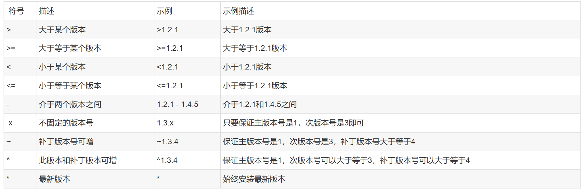

# command

- test and start is default supported by npm, so you don't need add "run" keywords before the command.
- dev is a custome name, so you need to run such command manually by npm run dev

# third party libraries

# nodemon

- official website: https://nodemon.io/
- key feature: Automatic restarting of application.
- npm install nodemon --save (production dependency)
- npm install nodemon --save-dev (development dependency)
- npm install nodemon -g (globally installed, use anywhere in your machine)
- replace "node index.js" with "nodemon index.js" to watch the changes and auto restart your server.

# the rule of npm version dependencies

- https://blog.51cto.com/u_15127697/3633383
- 
- "nodemon": "^3.1.3" => it stands for the main verison can not be changed but the sub version and patch version can be greater than current version.
